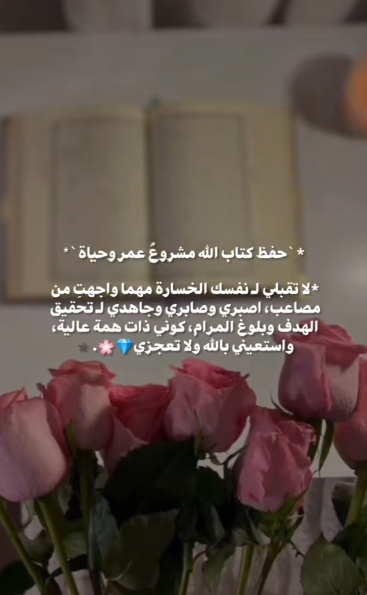
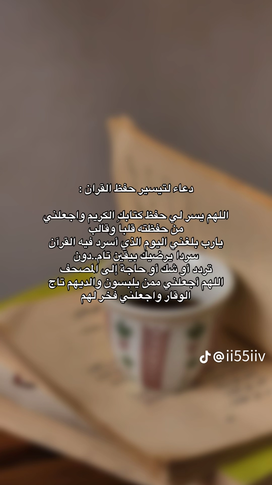

مشروع القران الكريم<!DOCTYPE html>
<html lang="ar">
<head>
  <meta charset="UTF-8">
  <title>مشروع القرآن الكريم</title>

  
</head>

<body>

<!-- القائمة -->
<nav>
  <a href="#home">الصفحة الرئيسية</a>
  <a href="#effects">آثار القرآن</a>
  <a href="#books">المؤلفات</a>
  <a href="#apps">التطبيقات</a>
  <a href="#advice">النصيحة</a>
  <a href="#dua">الدعاء</a>
  <a href="#contact">تواصل معنا</a>
</nav>

<!-- الصفحة الرئيسية -->
<section id="home">
  <h2>أهمية القرآن الكريم</h2>
  

    القرآن الكريم هو كلام الله الذي أنزله على سيدنا محمد ﷺ، وهو نور وهداية للمسلمين،
    فيه شفاء للقلوب وطمأنينة للنفس.
  

  

    لقراءة القرآن الكريم
    <a href="https://quran.com" target="_blank">اضغط هنا</a>
  

</section>

<!-- آثار القرآن -->
<section id="effects">
  <h2>آثار القرآن الكريم</h2>
  
يقوي الإيمان – يزرع الطمأنينة – يهذب الأخلاق

  
  
  
  
  
  
  

  <video controls>
    <source src="quran_video.mp4" type="video/mp4">
    المتصفح لا يدعم الفيديو
  </video>
</section>

<!-- المؤلفات -->
<section id="books">
  <h2>المؤلفات الموثوقة</h2>
  <ul>
    <li>جامع البيان – ابن جرير الطبري</li>
    <li>تفسير القرآن العظيم – ابن كثير</li>
    <li>الدر المنثور – السيوطي</li>
    <li>تيسير الكريم الرحمن – السعدي</li>
    <li>أضواء البيان – الشنقيطي</li>
  </ul>
</section>

<!-- التطبيقات -->
<section id="apps">
  <h2>تطبيقات حفظ القرآن</h2>
  <ul>
    <li>
      <a href="https://apps.apple.com/sa/app/tarteel-%D8%AA%D8%B1%D8%AA%D9%8A%D9%84-ai-quran/id1391009396" target="_blank">
        تطبيق ترتيل
      </a>
    </li>
    <li>
      <a href="https://quran.ksu.edu.sa/index.php?aya=64_1" target="_blank">
        موقع جامعة الملك سعود
      </a>
    </li>
  </ul>
</section>

<!-- النصيحة -->
<section id="advice">
  <h2>النصيحة</h2>
  
  
اجعلي القرآن رفيقك اليومي قراءةً وتدبرًا وعملاً.

</section>

<!-- الدعاء -->
<section id="dua">
  <h2>الدعاء</h2>
  
  
اللهم اجعل القرآن ربيع قلوبنا ونور صدورنا.

</section>

<!-- تواصل -->
<section id="contact">
  <h2>تواصل معنا</h2>
  
إعداد الطالبة: رهف رمزي

</section>

</body>
</html>
